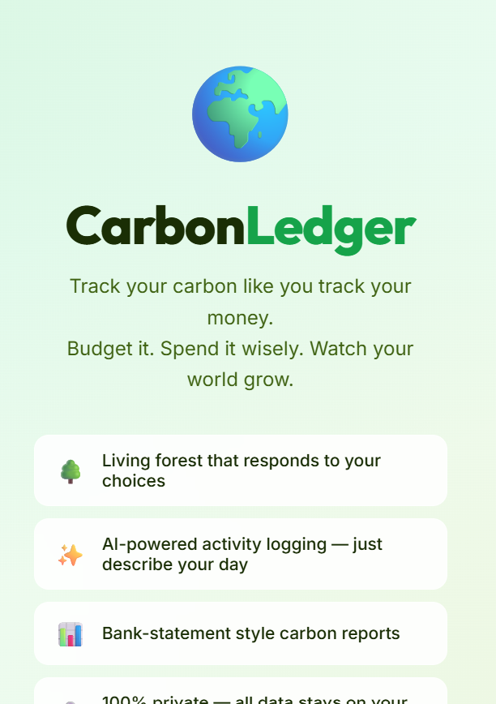
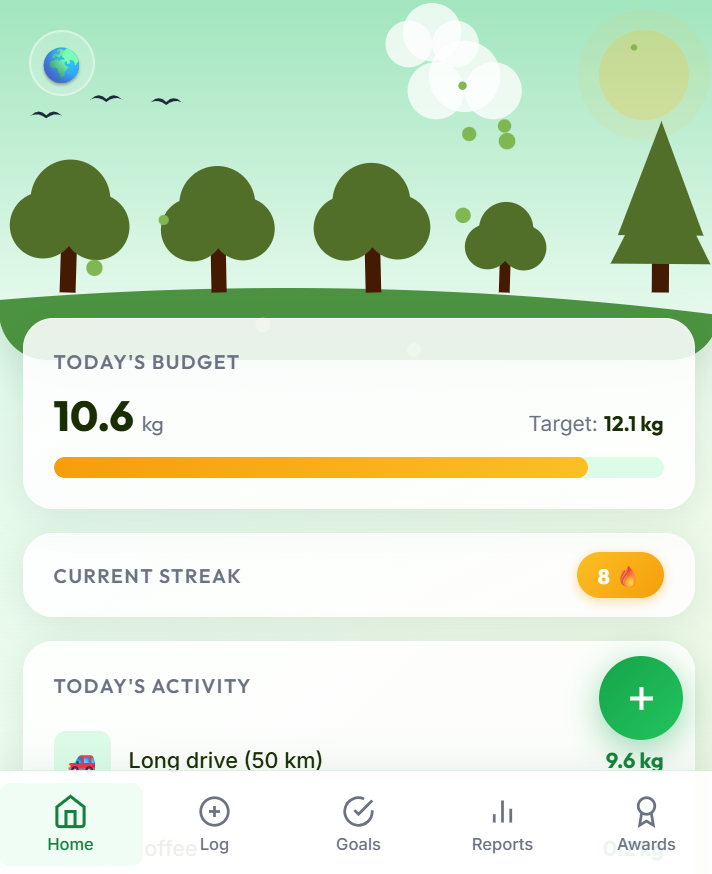
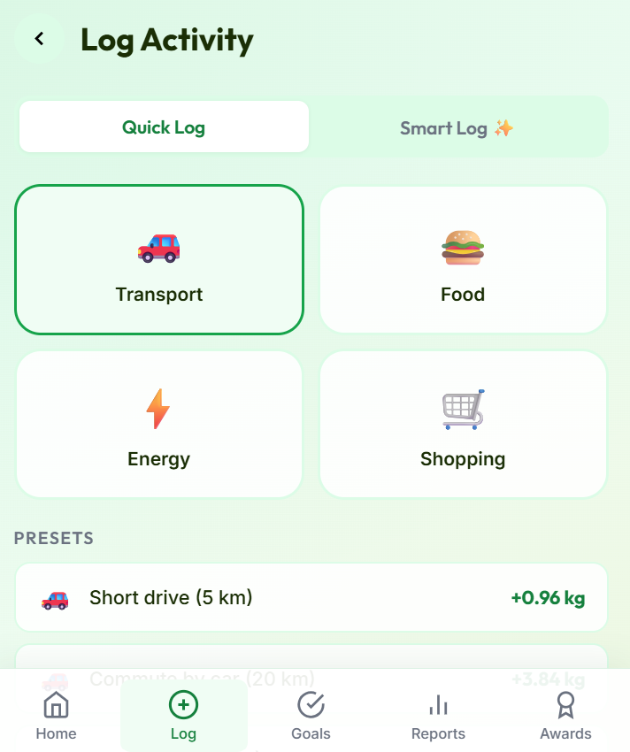
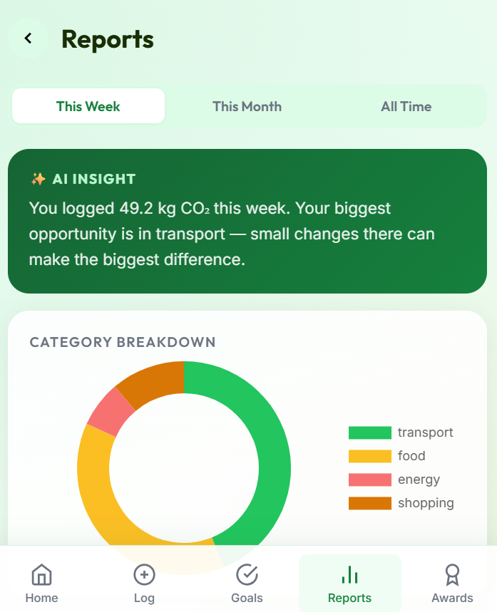
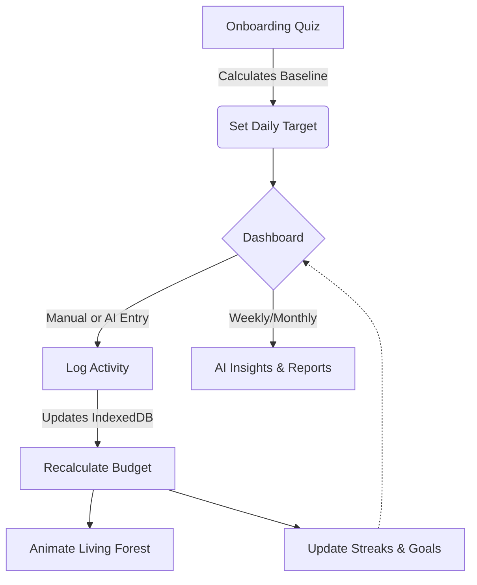
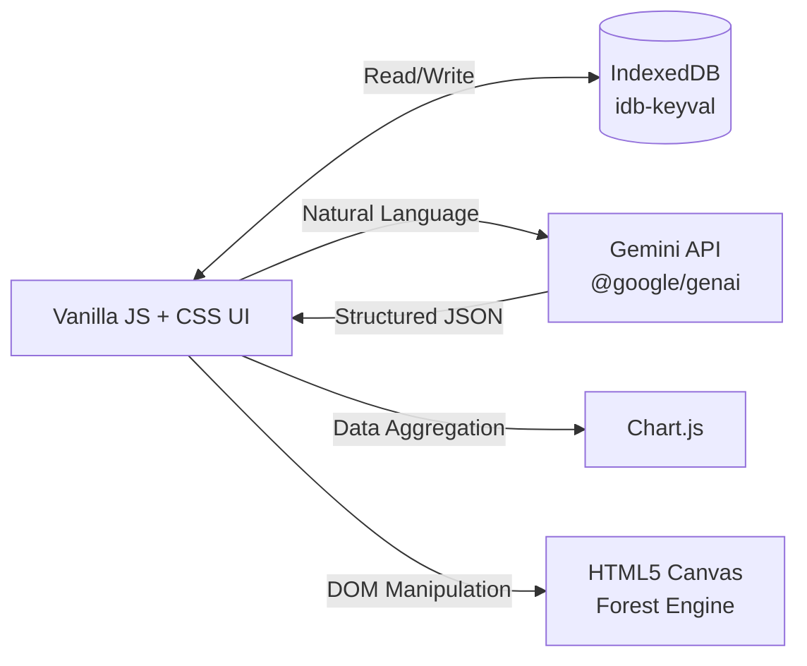

# 🌿 CarbonLedger

<div align="center">
  
  
  
  
</div>

<h3 align="center">
  <a href="https://co-ledger.vercel.app/">🌍 View Live Demo</a>
</h3>

**CarbonLedger** is a state-of-the-art, client-side progressive web app (PWA) designed to track, analyze, and reduce your daily carbon footprint. Built entirely as an intelligent, serverless Single Page Application (SPA), it empowers users through gamification, interactive data visualizations, and AI-driven insights—all completely local and private.

---

## 🏆 Hackathon Context

- **Chosen Vertical**: Carbon Footprint Tracking & Sustainability
- **Approach and Logic**: Bringing a strict, **fintech-inspired UX** to environmentalism. Just like a bank account, users have a daily carbon "budget". Every activity is a transaction. Coupled with a hardcoded emission factor database and **Gemini AI** for natural language processing, CarbonLedger makes tracking invisible emissions tangible.
- **Assumptions**: 
  - Emission factors are static averages sourced from EPA/DEFRA data (e.g., beef = 27kg CO₂/kg).
  - The daily budget model assumes consistent daily living patterns based on the onboarding survey.

---

## 📸 App Gallery

<p align="center">
  
  
  
  
</p>

---

## ✨ How It Works

CarbonLedger operates on a simple but powerful lifecycle:



1. **Onboarding**: A lifestyle quiz calculates your current daily CO₂ emissions baseline.
2. **Goal Setting**: You commit to a percentage reduction, generating your **Daily Carbon Budget**.
3. **Daily Tracking**: Log activities manually or use the AI Smart Log.
4. **Gamified Reduction**: Stay under budget to grow your "Living Forest", earn streaks, and unlock achievements.

---

## 🧠 Core Features

- **Dynamic Living Forest Dashboard**: Your daily emissions literally shape the app's ecosystem. Stay under budget to watch your forest thrive. Go over, and watch the skies grey and leaves fall.
- **AI Smart Log**: Type out your day in natural language (e.g., *"I drove 15km to work and ate a beef burger"*). The **Gemini API** instantly parses your activities and quantifies their carbon impact.
- **Interactive What-If Simulator**: Tweak your daily habits with sliders (like transit vs. driving) to see real-time projections of your annual savings.
- **Carbon Bank Statement**: View your weekly and monthly emissions styled exactly like a financial bank statement, complete with AI-generated insights.
- **Privacy-First Architecture**: 100% of your data is stored locally on your device via IndexedDB.

---

## 🤖 Built With AI

CarbonLedger was rapidly prototyped and built using advanced AI coding assistance, adhering to the hackathon's core objective of leveraging Generative AI for impactful solutions.

### AI Tools Used
- **Anti-Gravity (Gemini-Powered IDE Assistant)**: Used for full-stack scaffolding, component generation, and CSS design system creation.
- **Google Gemini API (`gemini-2.5-flash`)**: Powers the core natural language intelligence of the application.

### Human vs. AI Contribution
- **What GenAI Handled**: We used Anti-Gravity to accelerate the boilerplate setup, generate the custom vanilla CSS token system, implement the IndexedDB wrapper (`idb-keyval`), and write the HTML5 Canvas forest animation logic. The Gemini API handles the unstructured-to-structured data parsing in the Smart Log.
- **What Humans Designed**: The core concepts—the "fintech" bank-statement metaphor, the gamification mechanics (streaks, challenge rings, daily lottery), the hardcoded emission factor research (sourced from EPA/DEFRA), and the overall system architecture—were purely human-designed.

### Prompt Engineering Evolution
Integrating the Gemini API for the Smart Log required significant prompt iteration:
1. **Initial attempt**: *"Parse this text and tell me the carbon footprint."* (Resulted in unpredictable text formats).
2. **Second iteration**: Asked for JSON format. (Resulted in JSON wrapped in markdown blockticks which broke `JSON.parse`).
3. **Final production prompt**: We explicitly defined a strict JSON schema, embedded reference emission values directly in the system prompt to prevent hallucination, and added a regex stripper for markdown code blocks before parsing. This ensures 99% reliability for user inputs.

---

## 🏗️ System Architecture

CarbonLedger is a pure client-side SPA. No backend servers, no remote databases.



### 🛠️ Tech Stack
- **Framework**: Vite SPA (Vanilla JS, No React/TypeScript)
- **Styling**: Pure Vanilla CSS with a custom tokenized design system (Light/Dark mode, Glassmorphism)
- **Storage**: `idb-keyval` for IndexedDB wrapper
- **AI Integration**: Google Gemini API (`@google/generative-ai`)
- **Visuals**: `chart.js` for analytics, HTML5 Canvas for the living forest
- **Hosting**: Vercel

---

## 🚀 Getting Started

### Prerequisites
- Node.js (v18+)
- A [Google Gemini API Key](https://aistudio.google.com/app/apikey)

### Local Setup

1. **Clone the repository:**
   ```bash
   git clone https://github.com/aadhyanthk/Carbon-Ledger.git
   cd Carbon-Ledger
   ```

2. **Install dependencies:**
   ```bash
   npm install
   ```

3. **Configure Environment Variables:**
   Create a `.env` file in the root directory:
   ```env
   VITE_GEMINI_API_KEY=your_gemini_api_key_here
   ```

4. **Start the development server:**
   ```bash
   npm run dev
   ```

---

## 🌍 Deployment

### Vercel Deployment
1. Connect your GitHub repository to Vercel.
2. The framework preset should automatically be detected as **Vite**.
3. **Environment Variables:**
   - In your Vercel project settings, add an environment variable named `GEMINI_API_KEY` with your API key. 
   - **Crucial Security Note:** Do NOT prefix it with `VITE_` in Vercel. CarbonLedger uses a secure Vercel Serverless Function (`api/gemini.js`) to proxy all API requests in production. If you use `VITE_GEMINI_API_KEY`, Vite will embed the key into the client-side JavaScript bundle, making it visible to anyone. By using `GEMINI_API_KEY`, the key safely stays on the server.
4. Deploy!
